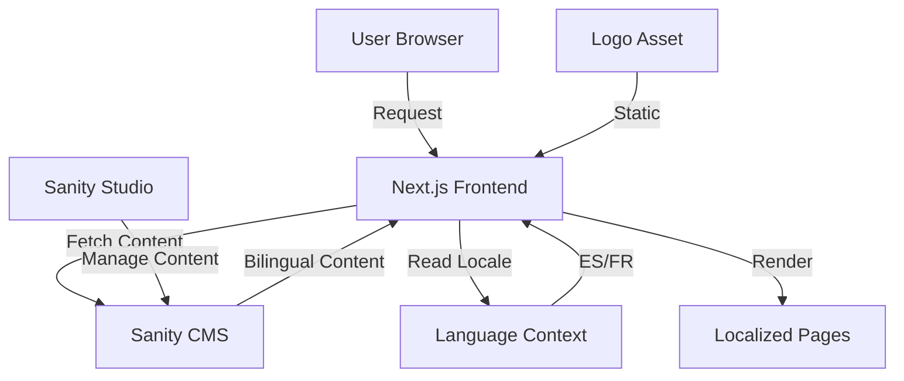

# Design Document - Uywakuna Blog

## Overview

This design document outlines the technical approach for transforming the Stablo Next.js blog template into "Uywakuna" (Tu zoológico virtual), a bilingual animal-focused blog supporting Spanish and French. The solution leverages the existing Stablo architecture built on Next.js 14, Sanity CMS v3, and Tailwind CSS while implementing comprehensive internationalization (i18n) and custom branding.

### Key Design Principles

1. **Minimal Disruption**: Extend existing Stablo components rather than rewriting from scratch
2. **Content-First i18n**: Implement bilingual support at the CMS schema level for maximum flexibility
3. **Performance**: Maintain Next.js optimizations (SSG, ISR, image optimization)
4. **Maintainability**: Keep customizations modular and well-documented
5. **SEO Excellence**: Ensure proper hreflang tags and language-specific metadata

## Architecture

### High-Level Architecture



### Technology Stack

- **Frontend Framework**: Next.js 14 with App Router
- **CMS**: Sanity CMS v3
- **Styling**: Tailwind CSS v3
- **State Management**: React Context API for language state
- **Storage**: Browser localStorage for language preference persistence
- **Deployment**: Vercel (recommended) or alternative platforms

### Directory Structure

```
stablo-free/
├── app/
│   ├── (website)/
│   │   ├── [locale]/          # NEW: Locale-based routing
│   │   │   ├── page.js
│   │   │   ├── post/[slug]/
│   │   │   ├── archive/
│   │   │   └── contact/
│   │   └── layout.tsx
│   └── providers.jsx          # MODIFIED: Add LanguageProvider
├── components/
│   ├── navbar.js              # MODIFIED: Add language selector
│   ├── footer.js              # MODIFIED: Update branding
│   └── languageSelector.js    # NEW: Language switcher component
├── lib/
│   ├── sanity/
│   │   └── schemas/
│   │       ├── post.js        # MODIFIED: Add bilingual fields
│   │       ├── category.js    # MODIFIED: Add bilingual fields
│   │       └── settings.js    # MODIFIED: Update branding fields
│   └── i18n/
│       ├── context.js         # NEW: Language context
│       ├── translations.js    # NEW: UI translations
│       └── utils.js           # NEW: i18n helper functions
├── public/
│   └── img/
│       └── uywakuna-logo.png  # NEW: Custom logo
└── styles/
    └── tailwind.css           # MODIFIED: Custom theme colors
```

## Components and Interfaces

### 1. Language Management System

#### LanguageContext (lib/i18n/context.js)

```javascript
interface LanguageContextType {
  locale: 'es' | 'fr';
  setLocale: (locale: 'es' | 'fr') => void;
  t: (key: string) => string;
}
```

**Responsibilities:**
- Manage current language state
- Persist language preference to localStorage
- Provide translation function for UI strings
- Trigger re-renders when language changes

**Implementation Details:**
- Use React Context API
- Initialize from localStorage or browser language
- Default to Spanish ('es') if no preference found

#### LanguageSelector Component (components/languageSelector.js)

```javascript
interface LanguageSelectorProps {
  className?: string;
  mobile?: boolean;
}
```

**Features:**
- Dropdown menu with ES/FR options
- Visual indicator for current language
- Smooth transition animations
- Accessible keyboard navigation
- Mobile-responsive design

**UI Design:**
- Desktop: Dropdown in navbar (right side)
- Mobile: Integrated in mobile menu
- Icons: Flag emojis or text labels (🇪🇸 Español / 🇫🇷 Français)

### 2. Sanity CMS Schema Extensions

#### Bilingual Post Schema

```javascript
{
  name: 'post',
  type: 'document',
  fields: [
    // Spanish fields
    { name: 'title_es', type: 'string', title: 'Title (Spanish)' },
    { name: 'slug_es', type: 'slug', title: 'Slug (Spanish)' },
    { name: 'excerpt_es', type: 'text', title: 'Excerpt (Spanish)' },
    { name: 'body_es', type: 'blockContent', title: 'Body (Spanish)' },
    
    // French fields
    { name: 'title_fr', type: 'string', title: 'Title (French)' },
    { name: 'slug_fr', type: 'slug', title: 'Slug (French)' },
    { name: 'excerpt_fr', type: 'text', title: 'Excerpt (French)' },
    { name: 'body_fr', type: 'blockContent', title: 'Body (French)' },
    
    // Shared fields
    { name: 'mainImage', type: 'image' },
    { name: 'author', type: 'reference' },
    { name: 'categories', type: 'array' },
    { name: 'publishedAt', type: 'datetime' },
    { name: 'featured', type: 'boolean' }
  ]
}
```

**Design Rationale:**
- Separate fields per language (vs. single field with nested objects) for better Sanity Studio UX
- Shared media and metadata to avoid duplication
- Language-specific slugs for SEO-friendly URLs

#### Bilingual Category Schema

```javascript
{
  name: 'category',
  type: 'document',
  fields: [
    { name: 'title_es', type: 'string', title: 'Title (Spanish)' },
    { name: 'title_fr', type: 'string', title: 'Title (French)' },
    { name: 'slug', type: 'slug', title: 'Slug' },
    { name: 'color', type: 'string', title: 'Color' },
    { name: 'description_es', type: 'text', title: 'Description (Spanish)' },
    { name: 'description_fr', type: 'text', title: 'Description (French)' }
  ]
}
```

**Animal Categories (Suggested):**
- Mammals / Mamíferos / Mammifères
- Birds / Aves / Oiseaux
- Reptiles / Reptiles / Reptiles
- Marine Life / Vida Marina / Vie Marine
- Insects / Insectos / Insectes
- Endangered Species / Especies en Peligro / Espèces Menacées

#### Settings Schema Updates

```javascript
{
  name: 'settings',
  fields: [
    { name: 'title_es', type: 'string', title: 'Site Title (Spanish)' },
    { name: 'title_fr', type: 'string', title: 'Site Title (French)' },
    { name: 'tagline_es', type: 'string', title: 'Tagline (Spanish)' },
    { name: 'tagline_fr', type: 'string', title: 'Tagline (French)' },
    { name: 'description_es', type: 'text', title: 'Meta Description (Spanish)' },
    { name: 'description_fr', type: 'text', title: 'Meta Description (French)' },
    // ... existing fields
  ]
}
```

### 3. Navigation Component Updates

#### Navbar Modifications (components/navbar.js)

**Changes Required:**
1. Replace "Stablo" text with "Uywakuna"
2. Integrate custom logo from `/images/logo.png`
3. Add LanguageSelector component
4. Update menu items with translated labels
5. Add tagline display option

**Menu Structure:**
```javascript
const menuItems = {
  es: {
    left: [
      { label: 'Inicio', href: '/es' },
      { label: 'Acerca de', href: '/es/about' },
      { label: 'Contacto', href: '/es/contact' }
    ],
    right: [
      { label: 'Archivo', href: '/es/archive' }
    ]
  },
  fr: {
    left: [
      { label: 'Accueil', href: '/fr' },
      { label: 'À propos', href: '/fr/about' },
      { label: 'Contact', href: '/fr/contact' }
    ],
    right: [
      { label: 'Archive', href: '/fr/archive' }
    ]
  }
}
```

#### Footer Modifications (components/footer.js)

**Changes Required:**
1. Update copyright to "Uywakuna"
2. Remove "Made by Web3Templates" or update attribution
3. Remove "Purchase Pro" backlink
4. Add language-specific footer text
5. Maintain theme switcher

### 4. Content Display Components

#### Post List Component (components/postlist.js)

**Modifications:**
- Accept `locale` prop
- Display `title_{locale}` and `excerpt_{locale}`
- Use locale-specific slugs for links
- Handle missing translations gracefully

#### Post Detail Page (app/(website)/post/[slug]/page.js)

**Modifications:**
- Detect locale from URL or context
- Fetch and display locale-specific content
- Show language availability indicator
- Implement hreflang links for SEO

## Data Models

### Content Fetching Pattern

```javascript
// lib/sanity/groq.js - Updated queries

export const postQuery = groq`
  *[_type == "post" && slug_es.current == $slug || slug_fr.current == $slug][0] {
    _id,
    title_es,
    title_fr,
    slug_es,
    slug_fr,
    excerpt_es,
    excerpt_fr,
    body_es,
    body_fr,
    mainImage,
    publishedAt,
    featured,
    author->{
      name,
      image
    },
    categories[]->{
      _id,
      title_es,
      title_fr,
      slug,
      color
    }
  }
`;

export const postsQuery = groq`
  *[_type == "post"] | order(publishedAt desc) {
    _id,
    title_es,
    title_fr,
    slug_es,
    slug_fr,
    excerpt_es,
    excerpt_fr,
    mainImage,
    publishedAt,
    featured,
    author->{
      name,
      image
    },
    categories[]->{
      title_es,
      title_fr,
      slug,
      color
    }
  }
`;
```

### Translation Helper Functions

```javascript
// lib/i18n/utils.js

export function getLocalizedField(object, fieldName, locale) {
  const localizedField = `${fieldName}_${locale}`;
  return object[localizedField] || object[fieldName] || '';
}

export function getLocalizedSlug(post, locale) {
  return post[`slug_${locale}`]?.current || post.slug?.current;
}

export function hasTranslation(post, locale) {
  return !!post[`title_${locale}`];
}
```

## Error Handling

### Missing Translation Handling

**Strategy:**
1. **Graceful Degradation**: Show available language if requested language missing
2. **User Notification**: Display subtle banner: "Este contenido no está disponible en francés"
3. **Fallback Chain**: FR → ES → Default

**Implementation:**
```javascript
function getPostContent(post, locale) {
  if (hasTranslation(post, locale)) {
    return getLocalizedContent(post, locale);
  }
  
  // Fallback to other language
  const fallbackLocale = locale === 'es' ? 'fr' : 'es';
  if (hasTranslation(post, fallbackLocale)) {
    return {
      ...getLocalizedContent(post, fallbackLocale),
      isFallback: true,
      fallbackLocale
    };
  }
  
  // Last resort: show error
  return null;
}
```

### CMS Connection Errors

**Handling:**
- Display user-friendly error messages
- Implement retry logic with exponential backoff
- Show cached content when available
- Log errors to monitoring service

### Language Persistence Errors

**Handling:**
- Catch localStorage errors (private browsing)
- Fall back to session storage
- Default to browser language detection
- Never block page render

## Testing Strategy

### Unit Tests

**Components to Test:**
- LanguageSelector: switching, persistence, accessibility
- Translation utilities: getLocalizedField, fallback logic
- Context providers: state management, localStorage sync

**Tools:**
- Jest for test runner
- React Testing Library for component tests
- Mock localStorage for persistence tests

### Integration Tests

**Scenarios:**
1. Language switching updates all UI elements
2. Content displays in correct language
3. URL routing works with locale prefixes
4. Fallback content displays when translation missing
5. SEO metadata updates per language

### E2E Tests (Optional)

**Critical Paths:**
- User selects language → preference persists → content updates
- Navigate from ES post → switch to FR → see FR version
- Share link with locale → recipient sees correct language

**Tools:**
- Playwright or Cypress for E2E testing

### Manual Testing Checklist

- [ ] Logo displays correctly in light/dark mode
- [ ] Language selector works on desktop and mobile
- [ ] All menu items translated correctly
- [ ] Post content displays in selected language
- [ ] Categories show translated names
- [ ] Footer shows correct branding
- [ ] SEO tags include hreflang
- [ ] Social sharing shows correct language
- [ ] Browser back/forward maintains language
- [ ] Direct URL access respects locale

## Styling and Theming

### Color Scheme

**Uywakuna Brand Colors (Animal-themed):**

```javascript
// tailwind.config.js additions

module.exports = {
  theme: {
    extend: {
      colors: {
        primary: {
          50: '#f0fdf4',   // Light green (nature)
          100: '#dcfce7',
          200: '#bbf7d0',
          300: '#86efac',
          400: '#4ade80',
          500: '#22c55e',  // Main brand color
          600: '#16a34a',
          700: '#15803d',
          800: '#166534',
          900: '#14532d',
        },
        accent: {
          50: '#fef3c7',   // Warm yellow (sun)
          500: '#f59e0b',  // Accent color
          700: '#b45309',
        }
      }
    }
  }
}
```

**Design Rationale:**
- Green represents nature and animals
- Warm accents evoke wildlife and energy
- Maintains good contrast for accessibility
- Works well in both light and dark modes

### Typography

**Current Setup (Maintain):**
- Sans-serif: Inter (clean, modern)
- Serif: Lora (for article content)

**Adjustments:**
- Slightly larger base font for readability
- Increased line-height for article content
- Bold headings for animal names

### Logo Integration

**Requirements:**
- Source: `/images/logo.png`
- Display size: ~120px width on desktop, ~80px on mobile
- Maintain aspect ratio
- Optimize for web (convert to WebP if needed)
- Provide dark mode variant if necessary

**Implementation:**
```javascript
// components/navbar.js
<Link href={`/${locale}`}>
  <Image
    src="/img/uywakuna-logo.png"
    alt="Uywakuna - Tu zoológico virtual"
    width={120}
    height={40}
    priority
  />
</Link>
```

## SEO and Metadata

### Language-Specific SEO

**Implementation:**
```javascript
// app/(website)/[locale]/layout.tsx

export async function generateMetadata({ params }) {
  const { locale } = params;
  const settings = await getSettings();
  
  return {
    title: settings[`title_${locale}`] || 'Uywakuna',
    description: settings[`description_${locale}`],
    alternates: {
      canonical: `https://uywakuna.com/${locale}`,
      languages: {
        'es': 'https://uywakuna.com/es',
        'fr': 'https://uywakuna.com/fr',
      }
    },
    openGraph: {
      title: settings[`title_${locale}`],
      description: settings[`description_${locale}`],
      locale: locale === 'es' ? 'es_ES' : 'fr_FR',
      alternateLocale: locale === 'es' ? 'fr_FR' : 'es_ES',
    }
  };
}
```

### Structured Data

**Article Schema:**
```json
{
  "@context": "https://schema.org",
  "@type": "Article",
  "headline": "Post Title",
  "inLanguage": "es",
  "author": {
    "@type": "Person",
    "name": "Author Name"
  },
  "datePublished": "2024-01-01",
  "image": "https://...",
  "publisher": {
    "@type": "Organization",
    "name": "Uywakuna",
    "logo": {
      "@type": "ImageObject",
      "url": "https://uywakuna.com/logo.png"
    }
  }
}
```

### Sitemap Generation

**Configuration:**
```javascript
// next-sitemap.config.js

module.exports = {
  siteUrl: 'https://uywakuna.com',
  generateRobotsTxt: true,
  alternateRefs: [
    {
      href: 'https://uywakuna.com/es',
      hreflang: 'es',
    },
    {
      href: 'https://uywakuna.com/fr',
      hreflang: 'fr',
    },
  ],
};
```

## Performance Considerations

### Image Optimization

- Use Next.js Image component for all images
- Implement lazy loading for below-fold images
- Serve WebP/AVIF formats
- Optimize logo and hero images

### Code Splitting

- Lazy load language selector on mobile
- Split translations by route
- Use dynamic imports for heavy components

### Caching Strategy

- Static Generation (SSG) for all posts
- Incremental Static Regeneration (ISR) with 60s revalidation
- CDN caching for static assets
- Browser caching for translations

### Bundle Size

- Keep translation files minimal
- Tree-shake unused Tailwind classes
- Analyze bundle with `@next/bundle-analyzer`
- Target: < 200KB initial JS bundle

## Migration and Deployment

### Migration Steps

1. **Backup**: Export existing Sanity data
2. **Schema Update**: Deploy new bilingual schemas
3. **Content Migration**: Add Spanish/French fields to existing content
4. **Code Deployment**: Deploy updated Next.js application
5. **Testing**: Verify all functionality in staging
6. **DNS**: Update domain to point to new deployment
7. **Monitoring**: Watch for errors and performance issues

### Environment Variables

```bash
# .env.local
NEXT_PUBLIC_SANITY_PROJECT_ID=your_project_id
NEXT_PUBLIC_SANITY_DATASET=production
NEXT_PUBLIC_SANITY_API_VERSION=2023-03-25
NEXT_PUBLIC_SITE_URL=https://uywakuna.com
NEXT_PUBLIC_DEFAULT_LOCALE=es
```

### Deployment Checklist

- [ ] Sanity schemas updated and deployed
- [ ] Environment variables configured
- [ ] Logo uploaded to `/public/img/`
- [ ] Custom domain configured
- [ ] SSL certificate active
- [ ] Analytics tracking installed
- [ ] Error monitoring configured
- [ ] Sitemap submitted to search engines
- [ ] Social media preview images tested

## Future Enhancements

### Phase 2 Features (Post-MVP)

1. **Additional Languages**: Add English, Portuguese
2. **Search Functionality**: Implement multilingual search
3. **Comments System**: Add Disqus or custom comments
4. **Newsletter**: Integrate email subscription
5. **Animal Database**: Create searchable animal encyclopedia
6. **Interactive Maps**: Show animal habitats
7. **Audio Pronunciations**: Add animal name pronunciations
8. **Kids Section**: Create child-friendly content area

### Technical Debt to Address

1. Remove unused Stablo demo content
2. Optimize Sanity queries (reduce over-fetching)
3. Implement comprehensive error boundaries
4. Add performance monitoring
5. Set up automated testing pipeline
6. Document custom components
7. Create content editor guide

## Conclusion

This design provides a comprehensive blueprint for transforming Stablo into Uywakuna while maintaining the template's strengths (performance, SEO, CMS integration) and adding robust bilingual support. The modular approach ensures maintainability and allows for future enhancements without major refactoring.

The key technical decisions—content-level i18n, React Context for language state, and extended Sanity schemas—balance flexibility with simplicity, making it easy for content editors to manage bilingual content while providing a seamless user experience.
